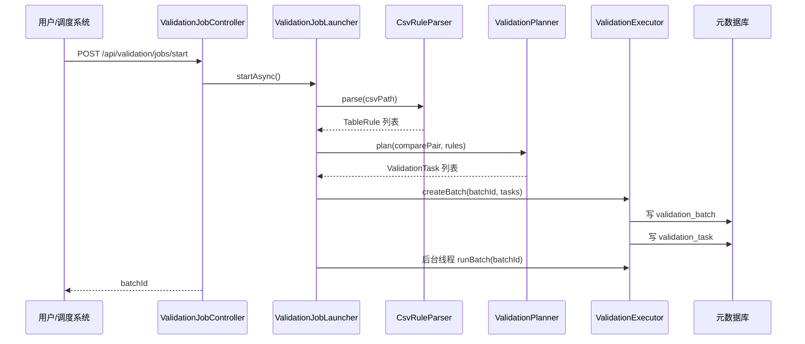
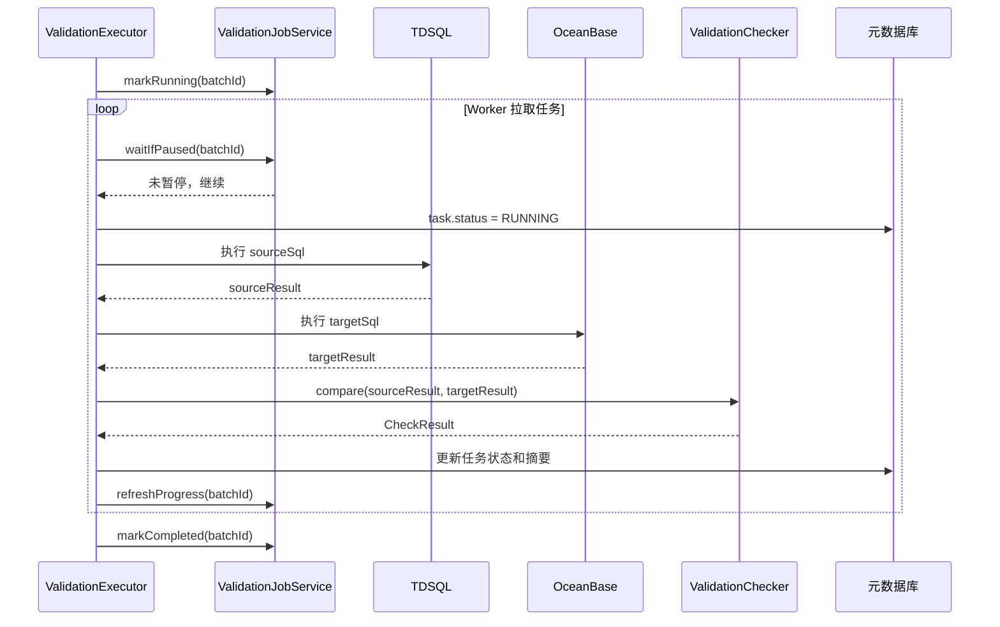
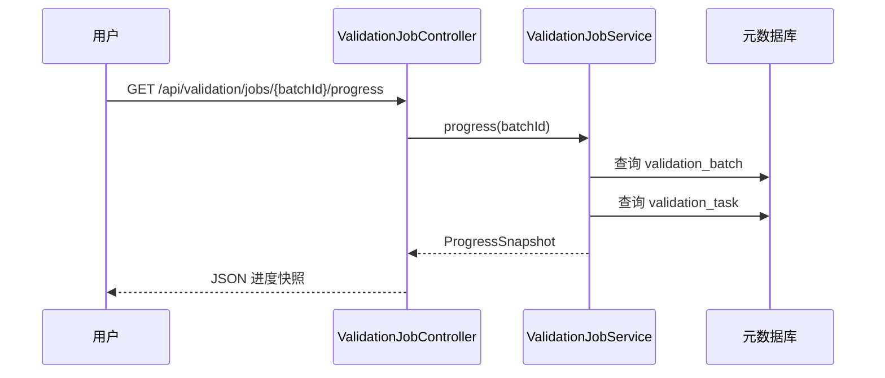
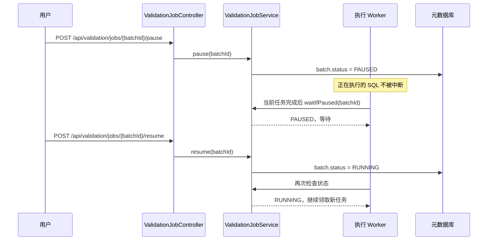

# TDSQL 到 OceanBase 数据迁移核验程序详细设计

## 1. 文档概述

本文档描述 TDSQL 到 OceanBase 数据迁移核验程序的详细设计。程序用于在迁移完成后连接源端 TDSQL 与目标端 OceanBase，对迁移结果执行配置化核验，重点验证数据是否丢失、金额是否一致、日期分布是否一致、空值是否异常、排序/字符集/编码是否存在兼容问题。

当前工程基于以下技术栈：

- JDK 8
- Spring Boot 2.7.x
- MyBatis Plus
- HikariCP
- H2 测试数据库
- CSV 表规则配置
- REST API 作业控制

## 2. 核心功能点

### 2.1 多数据库实例两两核验

程序在 `application.yml` 中配置多个数据源，并通过 `comparePairs` 声明源库与目标库的核验配对关系。

每个配对包含：

- `name`：配对名称
- `source`：源端数据源名称
- `target`：目标端数据源名称
- `enabled`：是否启用

任务生成时，程序只处理启用的配对，并根据 CSV 中的 `pair_name` 找到对应表规则。

### 2.2 CSV 驱动表级规则

程序通过 CSV 管理待核验表和字段，避免硬编码表名和字段名。

CSV 必须包含固定表头：

```csv
pair_name,enabled,source_table,target_table,primary_key,checkers,where_clause,amount_fields,date_field,null_fields,order_fields,compare_fields,sample_where,sample_limit,shard_column,shard_ranges,amount_tolerance
```

设计要点：

- 按表头名称解析，不依赖列顺序。
- 未识别表头或缺少必需表头时启动失败。
- `enabled=false` 时整张表跳过。
- `checkers` 为空时不生成任何校验任务。
- 表名、字段名做白名单校验。
- `where_clause` 和 `sample_where` 禁止包含写操作关键字和多语句符号。

### 2.3 Checker 可插拔

系统内置 6 个 Checker：

| Checker | 职责 | 必填配置 |
| --- | --- | --- |
| `ROW_COUNT` | 数据总数比对 | `source_table`, `target_table` |
| `AMOUNT_SUM` | 金额字段汇总比对 | `amount_fields` |
| `DATE_GROUP` | 日期字段分组比对 | `date_field` |
| `NULL_COUNT` | 空值数量比对 | `null_fields` |
| `ORDER_SAMPLE` | 排序抽样比对 | `order_fields`, `compare_fields` |
| `MD5_SAMPLE` | 关键字段 MD5 抽样比对 | `primary_key`, `compare_fields` |

所有 Checker 实现统一接口：

```java
public interface ValidationChecker {
    CheckType getType();

    boolean support(TableRule tableRule);

    List<ValidationTask> plan(ComparePair pair, TableRule tableRule);

    CheckResult compare(QueryResult sourceResult, QueryResult targetResult, TableRule tableRule);
}
```

Spring 启动后自动注入所有 `ValidationChecker` Bean，并注册到 `CheckerRegistry`。后续新增 Checker 时，只需要：

1. 新增 `CheckType` 枚举值。
2. 新增 `ValidationChecker` 实现类并声明为 Spring Bean。
3. 在 CSV 的 `checkers` 中使用新 Checker 名称。

主执行流程无需修改。

### 2.4 多表并行执行

程序使用 `tableParallelism` 控制任务并发度。执行器采用 worker 模式：

- 批次任务先全部落库。
- worker 从待执行任务列表中拉取任务。
- 每个任务独立更新状态。
- 单个任务失败不会阻塞其他任务。
- 已完成任务支持断点续跑跳过。

### 2.5 进度查看

程序提供 REST API 查询作业进度：

```http
GET /api/validation/jobs/{batchId}/progress
```

返回内容包括：

- 当前批次状态
- 任务总数
- 待执行数量
- 运行中数量
- 通过数量
- 失败数量
- 异常数量
- 跳过数量
- 完成百分比
- 当前正在比对的数据库配对
- 当前正在比对的源表和目标表
- 当前正在执行的 Checker

进度数据来自 `validation_task` 表聚合，同时刷新到 `validation_batch` 表，便于作业运行期间查看。

### 2.6 暂停与恢复

程序提供作业暂停和恢复接口：

```http
POST /api/validation/jobs/{batchId}/pause
POST /api/validation/jobs/{batchId}/resume
```

暂停语义：

- 暂停只影响“尚未开始”的任务。
- 已经进入 `RUNNING` 状态的任务不会被中断。
- 当前 SQL 执行完成后，worker 在领取下一个任务前检查批次状态。
- 如果批次状态为 `PAUSED`，worker 等待。
- 恢复后，worker 继续领取后续任务。

这样可以避免数据库 SQL 执行到一半被强制中断，降低对源库和目标库的影响。

### 2.7 断点续跑

任务状态持久化在 `validation_task` 表中。

续跑规则：

- `PASS` 默认跳过。
- `PENDING`、`FAIL`、`ERROR`、`RUNNING` 会重新执行。
- 如果配置 `rerunPassed=true`，则所有任务都会重新执行。

任务状态：

```text
PENDING
RUNNING
PASS
FAIL
ERROR
SKIPPED
```

批次状态：

```text
CREATED
RUNNING
PAUSED
COMPLETED
FAILED
```

## 3. 模块设计

### 3.1 配置模块

主要类：

- `ValidatorProperties`

职责：

- 加载 `validator` 前缀配置。
- 管理 CSV 路径、数据源、数据库配对、并行度、超时、续跑策略。

### 3.2 CSV 解析模块

主要类：

- `CsvRuleParser`
- `SqlSafetyValidator`

职责：

- 校验 CSV 表头完整性。
- 按表头名称映射字段。
- 解析 Checker、字段列表、分片范围和金额容差。
- 拦截非法表名、字段名和危险 SQL 条件。

### 3.3 数据源模块

主要类：

- `NamedDataSourceManager`
- `QueryExecutor`

职责：

- 根据配置创建多个命名数据源。
- 根据任务指定的数据源名称执行 SELECT SQL。
- 记录查询耗时。
- 执行前进行 SQL 安全校验。

### 3.4 任务规划模块

主要类：

- `ValidationPlanner`
- `CheckerRegistry`

职责：

- 根据数据库配对筛选表规则。
- 根据 CSV 中的 `checkers` 字段选择 Checker。
- 校验 Checker 所需字段是否满足。
- 调用 Checker 生成任务。
- 构建任务到表规则的索引。

### 3.5 Checker 模块

主要类：

- `RowCountChecker`
- `AmountSumChecker`
- `DateGroupChecker`
- `NullCountChecker`
- `OrderSampleChecker`
- `Md5SampleChecker`

职责：

- 生成对应核验 SQL。
- 比较源端和目标端结果。
- 返回 `PASS` 或 `FAIL`。

### 3.6 执行与作业控制模块

主要类：

- `ValidationExecutor`
- `ValidationJobService`
- `ValidationJobLauncher`
- `ValidationJobController`

职责：

- 创建批次并落库任务。
- 并行执行任务。
- 执行期间刷新进度。
- 支持暂停和恢复。
- 提供 REST API 查询和控制作业。

## 4. 数据库设计

### 4.1 validation_batch

用于保存批次级作业状态。

关键字段：

| 字段 | 说明 |
| --- | --- |
| `batch_id` | 批次号 |
| `status` | 批次状态 |
| `total_count` | 任务总数 |
| `pending_count` | 待执行任务数 |
| `running_count` | 运行中任务数 |
| `pass_count` | 通过任务数 |
| `fail_count` | 失败任务数 |
| `error_count` | 异常任务数 |
| `skipped_count` | 跳过任务数 |
| `current_pair_name` | 当前数据库配对 |
| `current_source_table` | 当前源表 |
| `current_target_table` | 当前目标表 |
| `current_check_type` | 当前 Checker |
| `start_time` | 开始时间 |
| `end_time` | 结束时间 |
| `update_time` | 更新时间 |

### 4.2 validation_task

用于保存每个核验任务。

关键字段：

| 字段 | 说明 |
| --- | --- |
| `id` | 任务 ID |
| `batch_id` | 批次号 |
| `pair_name` | 数据库配对名称 |
| `source_name` | 源端数据源名称 |
| `target_name` | 目标端数据源名称 |
| `source_table` | 源表 |
| `target_table` | 目标表 |
| `check_type` | Checker 类型 |
| `shard_no` | 分片编号 |
| `status` | 任务状态 |
| `retry_count` | 重试次数 |
| `source_sql` | 源端 SQL |
| `target_sql` | 目标端 SQL |
| `error_message` | 异常信息 |
| `result_summary` | 比对摘要 |

## 5. 关键业务流程

### 5.1 作业启动流程



### 5.2 任务执行流程



### 5.3 进度查询流程



### 5.4 暂停与恢复流程



## 6. REST API

### 6.1 启动作业

```http
POST /api/validation/jobs/start
```

响应：

```json
{
  "batchId": "xxxxxxxx-xxxx-xxxx-xxxx-xxxxxxxxxxxx"
}
```

### 6.2 查看进度

```http
GET /api/validation/jobs/{batchId}/progress
```

响应示例：

```json
{
  "batchId": "xxxxxxxx-xxxx-xxxx-xxxx-xxxxxxxxxxxx",
  "status": "RUNNING",
  "totalCount": 120,
  "pendingCount": 80,
  "runningCount": 4,
  "passCount": 30,
  "failCount": 2,
  "errorCount": 0,
  "skippedCount": 4,
  "progressPercent": 30.0,
  "currentPairName": "db1_compare",
  "currentSourceTable": "t_order",
  "currentTargetTable": "t_order",
  "currentCheckType": "MD5_SAMPLE"
}
```

### 6.3 暂停作业

```http
POST /api/validation/jobs/{batchId}/pause
```

### 6.4 恢复作业

```http
POST /api/validation/jobs/{batchId}/resume
```

## 7. 性能与安全设计

### 7.1 性能设计

- 多表并行由 `tableParallelism` 控制。
- 大表通过 `shard_column` 和 `shard_ranges` 拆分任务。
- 聚合类 SQL 优先，逐行比对只做抽样。
- 每条 SQL 设置超时时间。
- 任务状态实时落库，方便长任务监控。
- 暂停机制不强制中断 SQL，降低数据库端风险。

### 7.2 安全设计

- 业务库账号建议使用只读权限。
- 配置密码通过环境变量注入。
- 表名和字段名只允许安全标识符。
- 条件片段禁止危险关键字和多语句符号。
- 最终执行 SQL 必须是单条 SELECT。
- 报告和结果摘要默认不输出完整敏感字段值。

## 8. 测试设计

工程内置 H2 测试环境：

- `tdsql_01`：模拟源端 TDSQL
- `ob_01`：模拟目标端 OceanBase
- `validator_meta_test`：模拟元数据库

测试覆盖：

- CSV 表头校验
- CSV 按表头名称解析
- 非法 Checker 拦截
- 危险 SQL 拦截
- Checker 自动注册
- 每张表按需生成 Checker 任务
- H2 全流程核验通过
- 差异数据识别失败任务
- 断点续跑跳过已通过任务
- 进度统计正确
- 暂停/恢复接口不破坏批次数据

当前验证命令：

```bash
mvn test
```

## 9. 后续扩展建议

- 增加 `validation_difference` 表，保存字段级差异明细。
- 增加批次失败状态和异常告警。
- 增加 Web 页面展示进度和差异。
- 增加多实例部署下的分布式暂停控制。
- 增加数据库方言适配层，分别适配 MySQL、OceanBase Oracle 模式等。
- 增加 Prometheus 指标暴露，支持接入监控平台。
