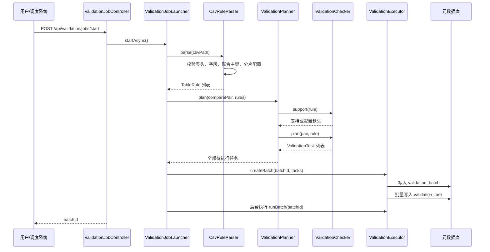
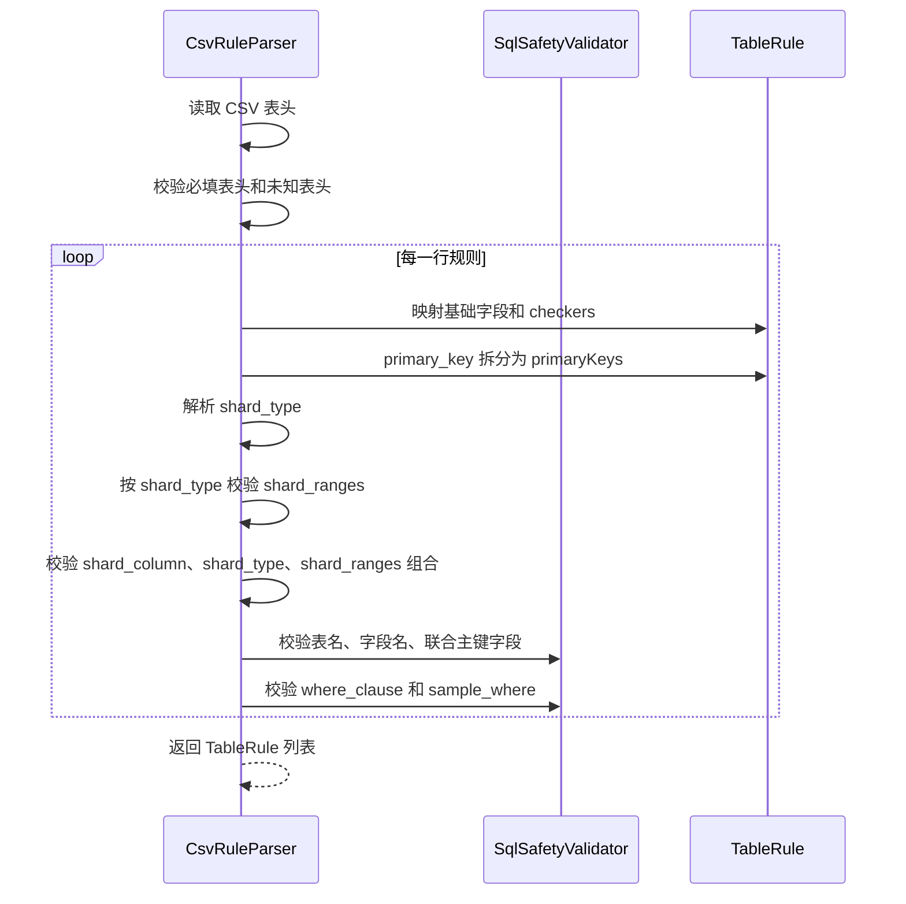
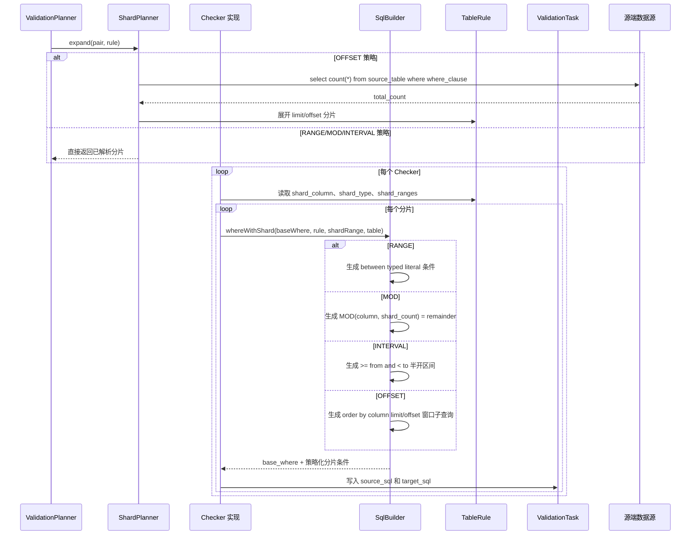
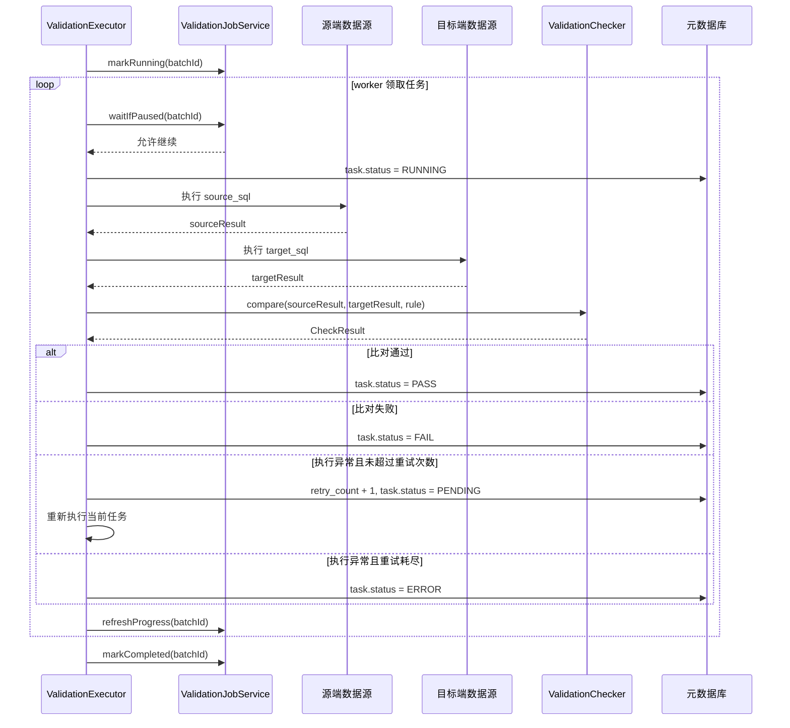
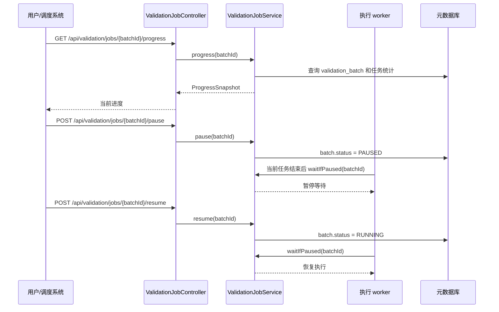

# TDSQL 到 OceanBase 数据迁移校验程序详细设计

## 1. 文档概述

本文档描述 TDSQL 到 OceanBase 数据迁移校验程序的详细设计。程序在迁移完成后连接源端 TDSQL 与目标端 OceanBase，对迁移结果执行配置化校验，重点验证数据是否丢失、金额是否一致、日期分布是否一致、空值是否异常、排序/字符集/编码是否存在兼容问题。

当前工程基于以下技术栈：

- JDK 8
- Spring Boot 2.7.x
- MyBatis Plus
- HikariCP
- H2 测试数据库
- CSV 表规则配置
- REST API 作业控制

## 2. 核心功能设计

### 2.1 多数据源两两校验

程序在 `application.yml` 中配置多个数据源，并通过 `comparePairs` 声明源库与目标库的校验配对关系。任务生成时只处理启用的配对，并根据 CSV 中的 `pair_name` 找到对应表规则。

### 2.2 CSV 驱动表级规则

程序通过 CSV 管理待校验表、字段、主键和分片配置，避免硬编码表名和字段名。

CSV 必须包含固定表头：

```csv
pair_name,enabled,source_table,target_table,primary_key,checkers,where_clause,amount_fields,date_field,null_fields,order_fields,compare_fields,sample_where,sample_limit,shard_column,shard_type,shard_ranges,amount_tolerance
```

设计要点：

- 按表头名称解析，不依赖列顺序。
- 未识别表头或缺少必需表头时启动失败。
- `enabled=false` 时整张表跳过。
- `checkers` 为空时不生成任何校验任务。
- 表名、字段名、联合主键字段名做白名单校验。
- `where_clause` 和 `sample_where` 禁止包含写操作关键字、多语句符号和注释符号。
- `sample_limit` 限制在 `1..10000`，避免配置错误触发超大抽样查询。

### 2.3 联合主键支持

`primary_key` 支持单主键和联合主键：

```csv
order_id
"tenant_id,order_id"
```

解析后会保存为主键字段列表。`MD5_SAMPLE` 使用该列表生成抽样 SQL：

- `select tenant_id, order_id, compare_fields...`
- `order by tenant_id, order_id`

联合主键只影响主键解析、校验、MD5 抽样排序和选择列，不改变 `validation_task` 表结构。

### 2.4 分片策略

大表可以通过 `shard_column`、`shard_type`、`shard_ranges` 拆分为多个任务。

`shard_type` 表头必须存在，但单元格可为空：

- 无分片时：`shard_column`、`shard_type`、`shard_ranges` 均可为空。
- 启用分片时：`shard_column` 与 `shard_ranges` 必须同时配置，并且 `shard_type` 必须填写。

分片模型从单一 `from/to` 范围扩展为策略化分片，支持 `RANGE`、`MOD`、`INTERVAL`、`OFFSET`，CSV 表头保持不变。

| 策略 | shard_type | shard_ranges 示例 | 生成规则 |
| --- | --- | --- | --- |
| 固定范围 | `NUMBER`、`DATE`、`TIME`、`DATETIME` | `1~1000;1001~2000` | 按显式范围生成多个 `between` 分片，`NUMBER` 兼容旧格式 `1-1000` |
| 数值取模 | `NUMBER_MOD` | `8` | 生成 8 个分片：`MOD(shard_column, 8) = 0..7` |
| 时间间隔 | `DATE_INTERVAL`、`TIME_INTERVAL`、`DATETIME_INTERVAL` | `2026-01-01~2026-02-01~1d` | 按步长展开半开区间：`shard_column >= from and shard_column < to` |
| Offset 平均切割 | `OFFSET` | `20` | 先按源表 `count(*)` 计算每片大小，再生成 `order by shard_column limit size offset n` 窗口分片 |

`shard_ranges` 配置示例：

```csv
1~1000;1001~2000
2026-01-01~2026-01-31
00:00:00~11:59:59;12:00:00~23:59:59
2026-01-01 00:00:00~2026-01-31 23:59:59
8
2026-01-01~2026-02-01~1d
2026-01-01 00:00:00~2026-01-03 00:00:00~12h
20
```

SQL 语义：

```sql
-- 固定范围
(base_where) and shard_column between from_literal and to_literal

-- 数值取模
(base_where) and MOD(shard_column, shard_count) = remainder

-- 时间间隔，使用半开区间避免边界重复
(base_where) and shard_column >= from_literal and shard_column < to_literal

-- Offset，使用源表 count 计算 limit/offset，并按 shard_column 稳定排序取窗口
(base_where) and shard_column in (
  select shard_column from (
    select shard_column from table_name
    where base_where
    order by shard_column
    limit shard_size offset shard_offset
  ) shard_window
)
```

时间间隔步长格式为 `数字 + 单位`。`DATE_INTERVAL` 支持 `d`，`TIME_INTERVAL` 和 `DATETIME_INTERVAL` 支持 `s`、`m`、`h`、`d`。Offset 分片要求 `shard_column` 是稳定排序列，推荐使用主键或唯一递增列。

`CsvRuleParser` 负责校验策略参数：`NUMBER_MOD` 和 `OFFSET` 的 `shard_ranges` 必须是正整数；时间间隔必须是 `start~end~step`；固定范围按 `shard_type` 校验数值、日期、时间或时间戳字面量。`ShardPlanner` 在任务规划阶段展开 offset 分片，并以源表 count 作为分片大小计算依据。`SqlBuilder.whereWithShard` 负责按分片策略生成最终 SQL 条件。

### 2.5 Checker 可插拔

系统内置 6 个 Checker：

| Checker | 职责 | 必填配置 |
| --- | --- | --- |
| `ROW_COUNT` | 数据总数比对 | `source_table`, `target_table` |
| `AMOUNT_SUM` | 金额字段汇总比对 | `amount_fields` |
| `DATE_GROUP` | 日期字段分组比对 | `date_field` |
| `NULL_COUNT` | 空值数量比对 | `null_fields` |
| `ORDER_SAMPLE` | 排序抽样比对 | `order_fields`, `compare_fields` |
| `MD5_SAMPLE` | 关键字段 MD5 抽样比对 | `primary_key`, `compare_fields` |

所有 Checker 实现统一接口，Spring 启动后自动注入并注册到 `CheckerRegistry`。新增 Checker 只需要新增 `CheckType` 枚举值、实现 `ValidationChecker` 并在 CSV 中引用名称。

### 2.6 执行与进度控制

程序使用 `tableParallelism` 控制任务并发度。执行器采用 worker 模式：

- 批次任务先全部落库。
- worker 从待执行任务列表中领取任务。
- 每个任务独立更新状态。
- 单个任务失败不会阻塞其他任务。
- 已完成任务支持断点续跑跳过。

作业进度来自 `validation_task` 聚合，并同步刷新到 `validation_batch`，通过 REST API 查询。

## 3. 模块设计

### 3.1 配置模块

主要类：`ValidatorProperties`

职责：

- 加载 `validator` 前缀配置。
- 管理 CSV 路径、数据源、数据库配对、并行度、超时和续跑策略。
- 根据数据源配置或 JDBC URL 解析 SQL 方言，用于日期分组 SQL 生成。

### 3.2 CSV 解析模块

主要类：`CsvRuleParser`、`SqlSafetyValidator`

职责：

- 校验 CSV 表头完整性。
- 解析 Checker、字段列表、联合主键、分片类型、分片范围和金额容差。
- 拦截非法表名、字段名和危险 SQL 条件。
- 校验分片配置成对出现，避免生成重复无分片任务。

### 3.3 Checker 模块

主要类：`RowCountChecker`、`AmountSumChecker`、`DateGroupChecker`、`NullCountChecker`、`OrderSampleChecker`、`Md5SampleChecker`

职责：

- 生成对应校验 SQL。
- 通过 `SqlBuilder.whereWithShard` 追加数字、日期、时间或时间戳分片条件。
- 比较源端和目标端结果，返回 `PASS` 或 `FAIL`。

### 3.4 执行与作业控制模块

主要类：`ValidationExecutor`、`ValidationJobService`、`ValidationJobLauncher`、`ValidationJobController`

职责：

- 创建批次并落库任务。
- 并行执行任务。
- 执行期间刷新进度。
- 支持暂停、恢复、失败状态和断点续跑。
- 提供 REST API 查询和控制作业。

## 4. 关键流程时序图

### 4.1 作业启动与任务规划



### 4.2 CSV 解析、联合主键与分片校验



### 4.3 分片 SQL 生成



### 4.4 任务执行、重试与结果比较



### 4.5 进度查询、暂停与恢复



## 5. 数据库设计

### 5.1 validation_batch

用于保存批次级作业状态，包括批次 ID、状态、任务统计、当前运行位置、开始时间、结束时间和更新时间。

批次状态：

```text
CREATED
RUNNING
PAUSED
COMPLETED
FAILED
```

### 5.2 validation_task

用于保存每个校验任务，包括数据源配对、源表、目标表、Checker 类型、分片编号、任务状态、重试次数、源端 SQL、目标端 SQL、异常信息和结果摘要。

任务状态：

```text
PENDING
RUNNING
PASS
FAIL
ERROR
SKIPPED
```

联合主键和分片配置不新增任务表字段，最终影响体现在生成后的 `source_sql` 和 `target_sql` 中。

## 6. 测试设计

工程内置 H2 测试环境：

- `tdsql_01`：模拟源端 TDSQL
- `ob_01`：模拟目标端 OceanBase
- `validator_meta_test`：模拟元数据库

测试覆盖：

- CSV 表头校验和按表头名称解析。
- `shard_type` 表头存在但值为空时，在无分片配置场景可通过。
- 配置 `shard_column` 或 `shard_ranges` 时缺少 `shard_type` 会失败。
- 联合主键 `"tenant_id,order_id"` 解析和字段校验。
- `NUMBER` 分片兼容旧 `1-10` 和新 `1~10`。
- `DATE`、`TIME`、`DATETIME` 分片范围格式校验。
- MD5 抽样 SQL 使用联合主键排序。
- 日期/时间戳分片 SQL 使用正确字面量。
- H2 全流程校验通过，包含联合主键表和时间戳分片任务。
- 差异数据识别失败任务。
- 断点续跑跳过已通过任务。
- 暂停/恢复接口不破坏批次数据。

验证命令：

```bash
mvn test
```

## 7. 后续扩展建议

- 增加 `validation_difference` 表，保存字段级差异明细。
- 增加 Web 页面展示进度和差异。
- 增加 Prometheus 指标暴露，支持接入监控平台。
- 为不同数据库模式补充更完整的 SQL 方言适配层。
